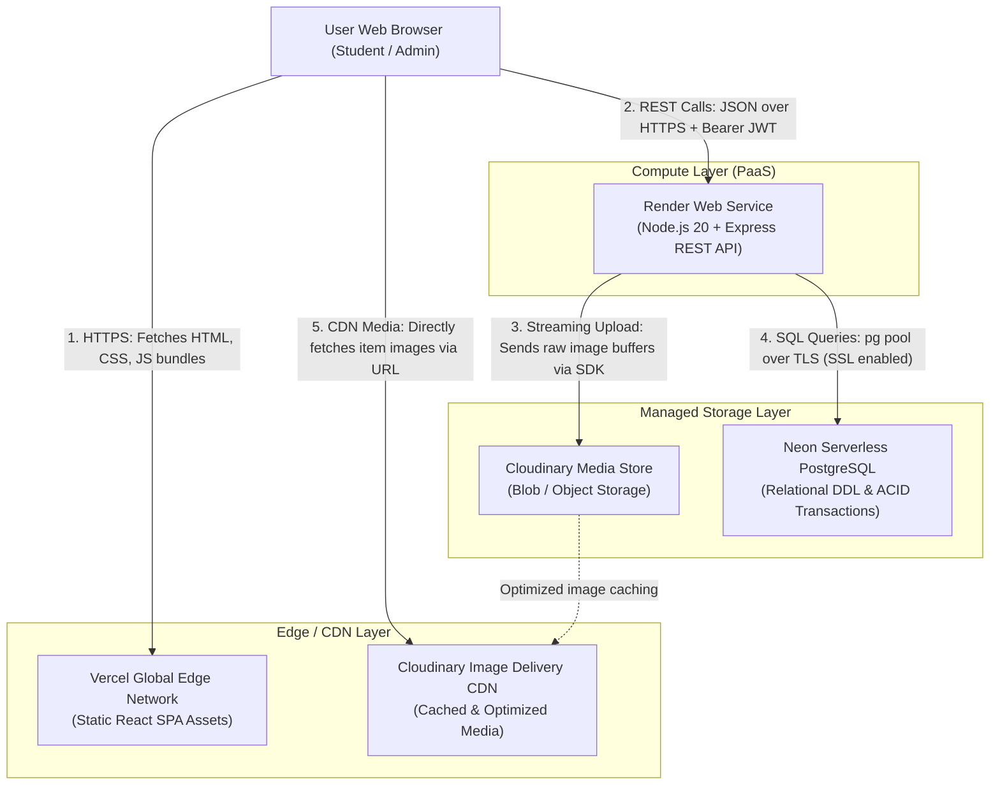
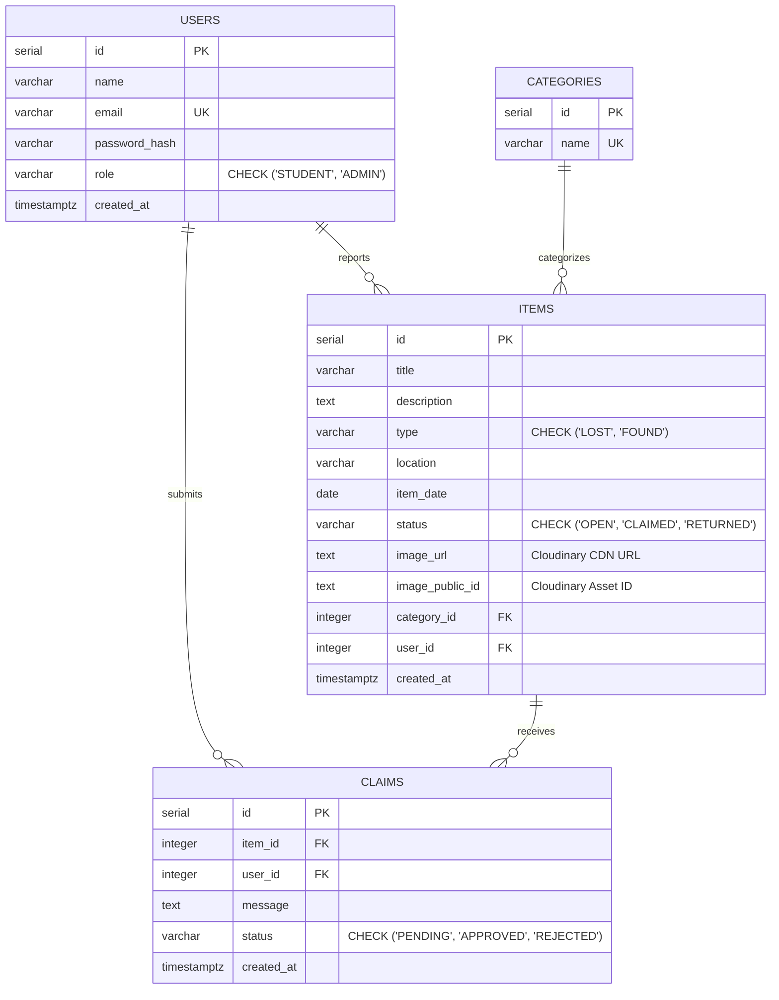

# Architecture & Cloud Infrastructure — CampusFind

CampusFind is a cloud-native lost and found platform developed for campus communities. The application is built using a modern decoupled cloud architecture, ensuring high scalability, data integrity, separation of concerns, and resilient media handling.

---

## 1. Cloud Architecture Overview

CampusFind adopts a modern multi-cloud architecture utilizing dedicated specialized cloud providers:
1. **Frontend Host (Vercel)**: Global Content Delivery Network (CDN) hosting the compiled React 18 single-page application (SPA).
2. **Backend Application Host (Render)**: Platform-as-a-Service (PaaS) container running the Node.js / Express REST API.
3. **Database as a Service (Neon)**: Serverless, managed PostgreSQL database.
4. **Cloud Media Storage & CDN (Cloudinary)**: Specialized object storage and media CDN for high-resolution item photos.

### Cloud Architecture Diagram

---

## 2. Relational Database Design & Entity Relationships

The data model is structured in third normal form (3NF) across four core entities: `users`, `categories`, `items`, and `claims`.

> [!IMPORTANT]
> **Core Cloud Computing Principle Demonstrated — Separation of Object Storage from Relational Storage:**
> Raw binary images and blobs are **never** stored inside PostgreSQL. Storing large binaries in relational databases causes table bloat, degrades buffer cache hit rates, slows index scans, and makes backups excessively large. Instead, image binaries are streamed directly to Cloudinary object storage, and only the lightweight metadata (`image_url` string and `image_public_id` string) is persisted in the PostgreSQL `items` table. The browser client downloads images directly from Cloudinary's edge CDN, completely bypassing the Express API server and database.

### Entity-Relationship (ER) Diagram

### Key Relational Constraints & Indices
- **Cascading Deletes**: Deleting a `user` automatically cascades to remove their reported items and claims. Deleting an `item` cascades to remove its associated claims.
- **Restrictive Foreign Key**: `items.category_id` uses `ON DELETE RESTRICT` to prevent accidental deletion of categories currently referenced by active items.
- **Unique Claim Constraint**: `UNIQUE (item_id, user_id)` guarantees that a student cannot submit duplicate claims on the exact same item.
- **Dedicated Performance Indexes**:
  - `idx_items_status` on `items(status)` for filtering open items.
  - `idx_items_type` on `items(type)` for quick LOST vs FOUND tabs.
  - `idx_items_category_id` on `items(category_id)` for category grouping.
  - `idx_claims_item_id` on `claims(item_id)` for lightning-fast claim lookups.

---

## 3. Cloud Computing Concepts Demonstrated

### 1. Managed Database as a Service (DBaaS)
Rather than provisioning, patching, backing up, and scaling a self-hosted PostgreSQL Linux server, CampusFind utilizes **Neon Serverless PostgreSQL**. Neon provides auto-scaling compute, point-in-time recovery, connection pooling, and automated high-availability storage separated from compute.

### 2. Platform as a Service (PaaS) for Compute
The backend REST API runs on **Render Web Services**, eliminating virtual machine management, OS patching, and network firewall configuration. Render automatically builds the Node.js environment from the GitHub repository, monitors health endpoints, handles TLS certificate generation, and restarts failed processes.

### 3. Separation of Object Storage from Relational Storage
Handling file uploads presents significant challenges for cloud scaling. By leveraging **Cloudinary** for media storage and transformation:
- Web server memory remains unburdened: Multer processes images via lightweight memory buffers before streaming them out.
- Database storage costs are minimized: PostgreSQL stores only short strings (`image_url` and `image_public_id`).
- Cloudinary automatically compresses, formats, and generates responsive images based on the viewing device.

### 4. Stateless API Architecture with JWT Authentication
The Express API is completely stateless:
- Sessions are not stored in memory or local disk files.
- Each request carries a cryptographically signed JSON Web Token (JWT) in the `Authorization: Bearer <token>` header.
- Because no session state is bound to a specific server instance, compute instances can horizontally scale across multiple regions or behind a round-robin load balancer without needing sticky sessions or centralized Redis session stores.

### 5. Content Delivery Network (CDN) Delivery
Static assets (HTML, JavaScript, CSS) are hosted on Vercel's Edge Network, which replicates assets to hundreds of points of presence (PoPs) globally. Similarly, images stored in Cloudinary are distributed and cached by its global media CDN. As a result, 95%+ of bandwidth consumption terminates at the edge cache rather than hitting the backend application server.

### 6. Environment-Based Configuration and Secret Management
Following the Twelve-Factor App methodology (Config), zero secrets, tokens, or credentials are hardcoded into the source code. Database connection strings, JWT signing keys, and Cloudinary API credentials are injected at runtime via environment variables (`.env` locally, encrypted Environment settings on Render and Vercel).

### 7. Free-Tier Cold-Start Lifecycle & Mitigations
On free-tier compute hosts like Render, inactive web services spin down to zero instances after 15 minutes of inactivity. When a new HTTP request arrives, the cloud provider provisions a container, boots Node.js, and initializes database connection pools (a process taking 40–50 seconds). The frontend is architected to display smooth loading spinners and timeout handling to inform users during these initial cold starts.

### 8. ACID Transactional Integrity
When an administrator approves an ownership claim, multiple tables must be updated simultaneously:
1. The chosen claim must transition from `PENDING` to `APPROVED`.
2. All competing claims on that item must transition from `PENDING` to `REJECTED`.
3. The item itself must transition from `OPEN` to `CLAIMED`.

CampusFind executes this critical workflow inside a dedicated PostgreSQL transaction (`BEGIN`, `COMMIT`, `ROLLBACK`) using a dedicated pooled client. If any step fails or network interruption occurs, the entire set of changes rolls back, preventing inconsistent database states.
